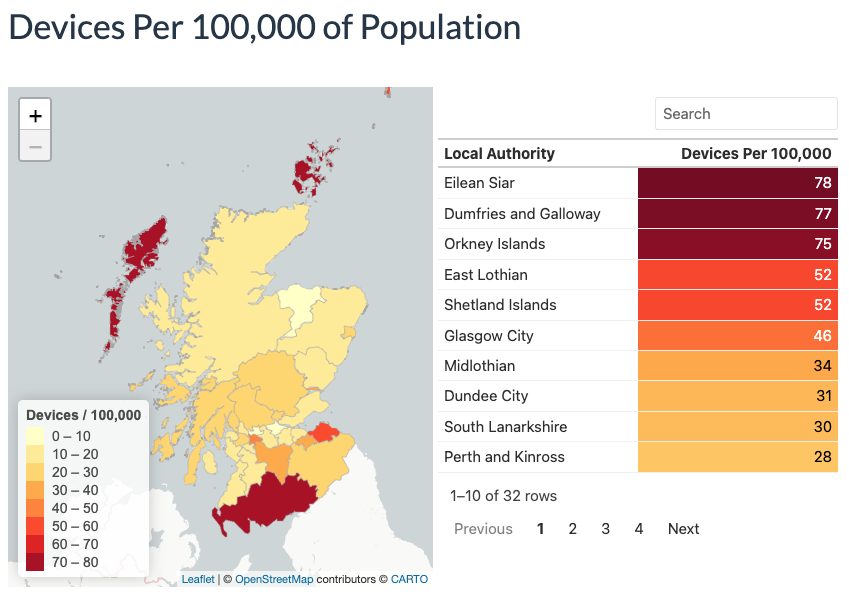
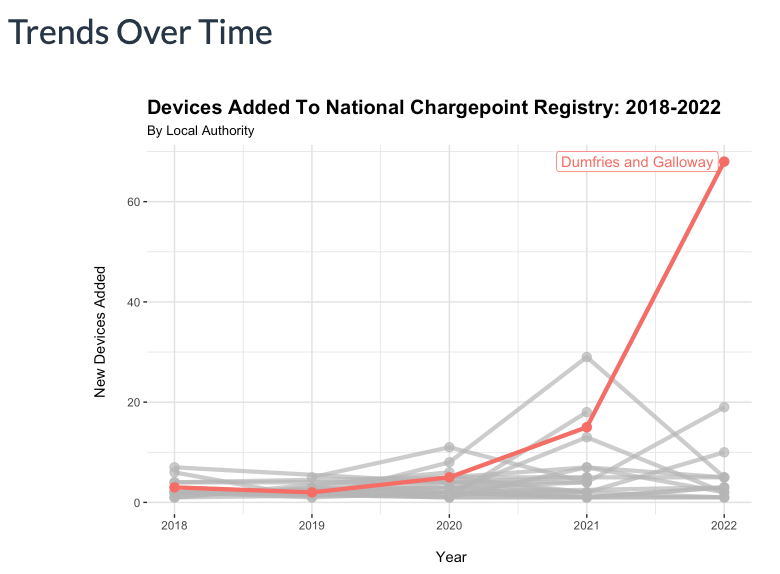

# National Chargepoint Registry: Report

[LINK TO REPORT HOSTED ON GITHUB PAGES](https://stenhousestuart.github.io/ncr_report/)

------------------------------------------------------------------------

## Introduction

A small project completed to demonstrate the application of electric vehicle data and geospatial analysis. Using information from the National Chargepoint Registry, interactive maps and data tables offer insights to support analysis of the number of charging devices in Scotland's Local Authorities.

*Disclaimer: This report is intended as a proof ability to produce technical reports and visualisations using relevant data. Additional data sources and investigation is required in order to make a final estimate on the numbers of chargepoints in each Local Authority.*

------------------------------------------------------------------------

## Screenshots

------------------------------------------------------------------------

## Conclusions

- Dumfries and Galloway is notable for having a significant amount of charging devices per 100,000 population, as well as a high total number of charging devices.

- Dumfries and Galloway added more new devices in 2022 than any region has done in a previous year (68).

- Further work should be completed to understand the nature of the increase in new devices added in Dumfries and Galloway in 2022. For example, were these all newly installed devices, OR was there a delay in adding devices to the register from previous years? If these were all new devices, consideration should be given to the strategy and initiatives utilised.

------------------------------------------------------------------------

## Key Skills / Technologies Used

**Skills**

-   Exploratory Data Analysis
-   Data Visualisation
-   Geospatial Analysis
-   Data Wrangling
-   Data Cleaning

**Languages**

-   R
-   RMarkdown
-   HTML
-   CSS

**Packages**

- tidyverse
- leaflet
- sf
- gt
- gghighlight
- janitor
- htmlwidgets

**Technlogoies**

-   Git
-   GitHub

------------------------------------------------------------------------

